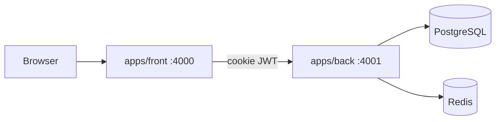

# Nuxt Nest Starter

pnpm + Turborepo starter extracted from the [sarpbc](https://github.com/sarpbc/sarpbc) stack: Nuxt 4, NestJS (Fastify), MikroORM, PostgreSQL, Redis, and cookie JWT auth.

Use it as a GitHub template, then rename the `@starter/*` package scope to your own.



## What you get

- `apps/front` — Nuxt 4 SSR site (Nuxt UI, i18n `en` / `fr`, cookie session)
- `apps/back` — NestJS API (Fastify, MikroORM, staff permissions, Google OAuth optional)
- `packages/types` and `packages/utils` — framework-free shared code
- `packages/composables` — Nuxt API client and `useUser()`
- `packages/ui` — empty Nuxt module for shared Vue components you add later
- Dockerfiles, local Compose, PR CI, oxlint / oxfmt

Redis is included so `/health` and future cache/session work have a broker. Nothing else uses it yet.

## Prerequisites

- Node.js 24.13.1 (see `.nvmrc`)
- pnpm 11+
- Docker and Docker Compose for local Postgres and Redis

## Install

```bash
pnpm install
cp apps/front/.env.example apps/front/.env
cp apps/back/.env.example apps/back/.env
```

## Run locally

```bash
docker compose -f docker-compose.local.yml up -d
pnpm --filter back run mikro:migrate
pnpm dev
```

- Front: http://localhost:4000
- API: http://localhost:4001/health

Register on the front, then promote yourself to staff if you need API permissions:

```sql
UPDATE "user" SET role = 'admin' WHERE email = 'you@example.com';
```

Roles are `admin` (all permissions) and `editor` (`content.manage`). Edit the matrix in `apps/back/src/user/domain/staff-access.ts` and `packages/types/src/user.ts`.

## Scripts

| Script                        | What it does   |
| ----------------------------- | -------------- |
| `pnpm dev`                    | Run all apps   |
| `pnpm dev:front` / `dev:back` | One app        |
| `pnpm build`                  | Build all      |
| `pnpm lint` / `pnpm fmt`      | oxlint / oxfmt |
| `pnpm test:back`              | Jest unit tests |

## Auth

Browser sessions use an httpOnly `access_token` cookie (30 days). Front calls Nest directly (`NUXT_PUBLIC_API_BASE`) with `credentials: "include"`. There is no Nitro API proxy.

Passwords must be 8–100 characters and include a letter and a number.

Optional Google OAuth: set `GOOGLE_CLIENT_ID` / `GOOGLE_CLIENT_SECRET` on the API and `NUXT_PUBLIC_GOOGLE_AUTH=true` on the front.

## Production

Copying `.env.example` is not enough. In production the API refuses to start unless:

- `JWT_KEY` is at least 32 random characters
- `FRONT_URL` is set to the public site origin (used for CORS and OAuth return)

CORS allows localhost only in development. In production it allows `FRONT_URL` plus optional `CORS_ORIGINS` (comma-separated). Set `COOKIE_DOMAIN` if the API and site share a parent domain.

Build images from the repository root:

```bash
docker build -f apps/back/Dockerfile --build-arg APP_RELEASE=local .
docker build -f apps/front/Dockerfile --build-arg APP_RELEASE=local --build-arg NUXT_PUBLIC_API_BASE=https://api.example.com .
```

Put production secrets in Docker secrets or your host secret store (`/run/secrets/starter_jwt_key`, `starter_db_password`, …). See `apps/back/.env.example`.

## Adding a feature

1. New Nest module under `apps/back/src/<feature>/` (entity, repository, service, controller, DTOs).
2. Register the entity in `mikro-orm.entities.ts` and create a migration (`pnpm --filter back mikro:migrate:create`).
3. Shared types go in `packages/types`. Shared Vue components go in `packages/ui`.
4. Nuxt pages consume the API with `apiFetch`. Staff routes: `@RequirePermissions()` + `PermissionGuard` on the API.

## License

MIT. See `CONTRIBUTING.md` and `CODE_OF_CONDUCT.md`.
